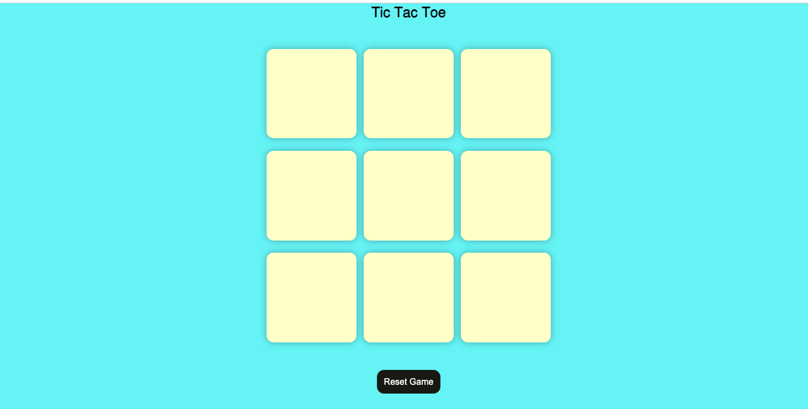

output:  

### Implementing 2D logic 

```javascript
console.log('bappa');
2D array 
let arr = [
    ['1', '2', '33'],
    ['aa', 'bb', 'cc'],
    ['bappa', 'kappa', 'dappa']
]
console.log('0th index->', arr[0]);
console.log('1st index->', arr[1]);
console.log('2nd index->', arr[2]);

console.log('◼️ Access [0][0] position ->', arr[0][0])
console.log('◼️ Access [0][1] position ->', arr[0][1])
console.log('◼️ Access [0][2] position ->', arr[0][2])
```


### Step by Step Process

##### todo:0 ---------- start ----------**

**Take all the  dom variables**

```java    
let boxes = document.querySelectorAll('.box');
let resetBtn = document.getElementById('reset-btn');
let messageContainer = document.querySelector('.msg-container');
let showWinningMsg=document.getElementById('msg');
let newGame =document.getElementById('new-btn');

let trunO = true;
```
**todo:1 win patterns**

```javascript
const winPatterns = [
    [0, 1, 2],
    [0, 3, 6],
    [0, 4, 8],
    [1, 4, 7],
    [2, 5, 8],
    [2, 4, 6],
    [3, 4, 5],
    [6, 7, 8],
];
```

**todo: 6 reset game**

```javascript
const resetGame =()=>{
    trunO =true;
    enabledBoxes();
    messageContainer.classList.add('hide')
}
```
**todo:2 addEventListener for every box**
    - check all boxes are clicked 
    - then give innerText to see print or not 
    - check the trun0 [O or X is working or not ]
     - double click is disabled
    - jokoni button click korbo tokoni dekbo j keu win hocce ki na .
```javascript
boxes.forEach((box) => {
    box.addEventListener('click', () => {
        // console.log('box clicked');
        // box.innerText ='X'
        if (trunO) {
            box.innerText = '⭕'
            trunO = false;
        } else {
            box.innerText = '❎'
            trunO = true;
        }
        box.disabled = true;
        // 3. check winner
        checkWinner();
    })
});
```
**todo:7 disable field after one person win**

const disabledBoxes =()=>{
    for(let box of boxes){
        box.disabled = true;
    }
}
**todo:8 enable field after one person win**
```javascript
const enabledBoxes =()=>{
    for(let box of boxes){
        box.disabled = false;
        box.innerText="";
    }
}
```


**todo:4 check winner**
```javascript
const showWinner=(WinnerValue)=>{
    showWinningMsg.innerText=`Congratulations!!! Mr.${WinnerValue}`;
    messageContainer.classList.remove('hide');
    disabledBoxes();
};
```
**todo:3 check winner**
- jokoni button click korbo tokoni dekbo j keu win hocce ki na .
- winning pattern check korte hbe [0,0][0,1][0,2] position e same 
- element hole win hbe. 
-  so win pattern er uprey loop chalabo
-  result pabo array and ekane array er position check korbo
- position paile sekane inner text check korbo
- winner pabar por sob button k disable kore dibo

```javascript
const checkWinner =()=>{
    for(let pattern of winPatterns){
        // console.log('indexs of patterns:',pattern[0],pattern[1],pattern[2] ); // result is an array 
        // console.log(pattern[0],pattern[1],pattern[2] ); 
        // console.log(boxes[pattern[0]],boxes[pattern[1]],boxes[pattern[2]]);

        // this is my postioin 0 { boxes[pattern[0]].innerText,}
        // console.log(
        //     boxes[pattern[0]].innerText, //--pos1 value
        //     boxes[pattern[1]].innerText,
        //     boxes[pattern[2]].innerText,
        
        // );

        let postion1Value = boxes[pattern[0]].innerText;
        let postion2Value = boxes[pattern[1]].innerText;
        let postion3Value = boxes[pattern[2]].innerText;

        //todo: 4 check condition [is empty or not , three values are same or not]
            // check post1 , post2 , post3 values are not empty
            if(postion1Value !=="" && postion2Value !=="" && postion3Value !==""){

                //now check winning pattern
                if(postion1Value ===postion2Value && postion2Value===postion3Value){
                    // console.log('Winner is ', postion1Value);
                    //show winner functon
                    showWinner(postion1Value);
                 
                }
            }
    }
};
```
```javascript

resetBtn.addEventListener('click', resetGame);
newGame.addEventListener('click', resetGame);
```


