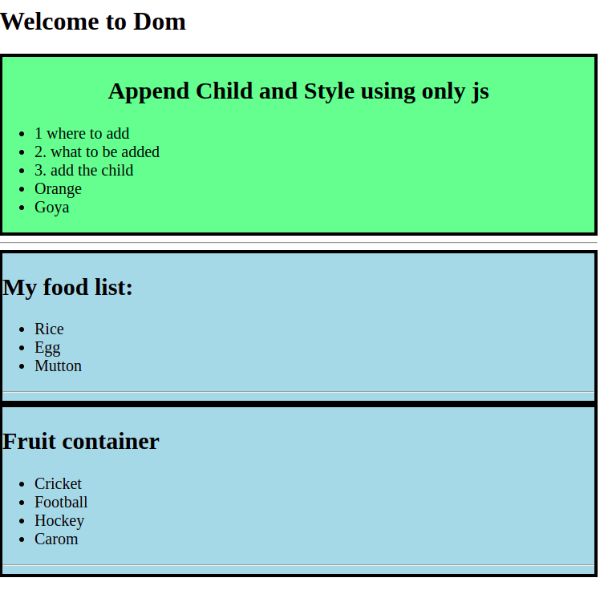

 
`code output:`
 
**index.html**
```html
<!DOCTYPE html>
<html lang="en">
<head>
    <meta charset="UTF-8">
    <meta http-equiv="X-UA-Compatible" content="IE=edge">
    <meta name="viewport" content="width=device-width, initial-scale=1.0">
    <title>Basic dom</title>
</head>
<body>
    <header>
         <h1>Welcome to Dom</h1>
    </header>
    <main id="main-container">
        <section id="fruits-container">
            <h1 id="fruits-title">Append Child and Style using only js </h1>
            <ul id="fruits-list">
                <li>1 where to add</li>
                <li>2. what to be added</li>
                <li>3. add the child</li>
                <li>Orange</li>
            </ul>
        </section>
        <hr>
    </main>
    <script src="./script.js"></script>
    <script src="./style.js"></script>
</body>
</html>
```
--

**style.js**

```js 
const sections =document.querySelectorAll('section');
// console.log(sections);
for(const section of sections){
    // console.log(section);
    section.style.border='4px solid black';
    section.style.backgroundColor='lightBlue';
    section.style.fontSize='20px';
};


const fruitsContainer =document.getElementById('fruits-container');
console.log(fruitsContainer);
fruitsContainer.style.backgroundColor='lightGreen';

const fruitsTitle= document.getElementById('fruits-title');
fruitsTitle.style.textAlign='center';
```

--

**script.js**

```javascript

//todo: append new child

// 1- where to add
const fruitsList =document.getElementById('fruits-list');

//2. what to be added
const li =document.createElement('li');
li.innerText='Goya';

// 3. add the child
fruitsList.appendChild(li);


//todo: add new section

const mainContainer =document.getElementById('main-container');
// console.log(mainContainer)
const section=document.createElement('section');
const h1 =document.createElement('h1');
h1.innerText='My food list:';
section.appendChild(h1)

const ul =document.createElement('ul');
const li1=document.createElement('li');
const li2=document.createElement('li');
const li3=document.createElement('li');
const hr =document.createElement('hr');


li1.innerText='Rice';
li2.innerText='Egg';
li3.innerText='Mutton';

ul.appendChild(li1);
ul.appendChild(li2);
ul.appendChild(li3);


section.appendChild(ul);
section.appendChild(hr);
mainContainer.appendChild(section);


// todo: best way to append section

// set inner html directly

const sectionGame =document.createElement('section');
sectionGame.innerHTML=`
            <h1>Fruit container </h1>
            <ul>
                <li>Cricket</li>
                <li>Football</li>
                <li>Hockey</li>
                <li>Carom</li>
            </ul>
            <hr>
`;
mainContainer.appendChild(sectionGame);
```